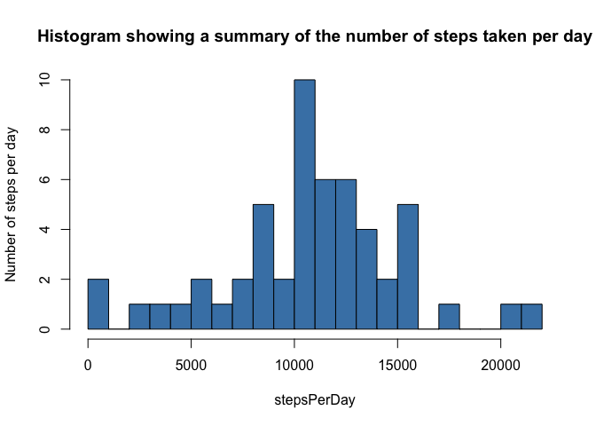
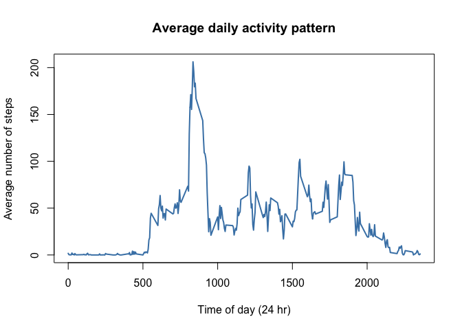
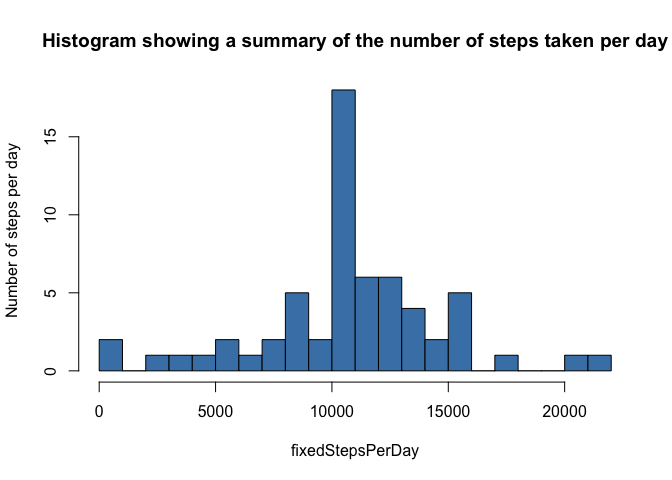
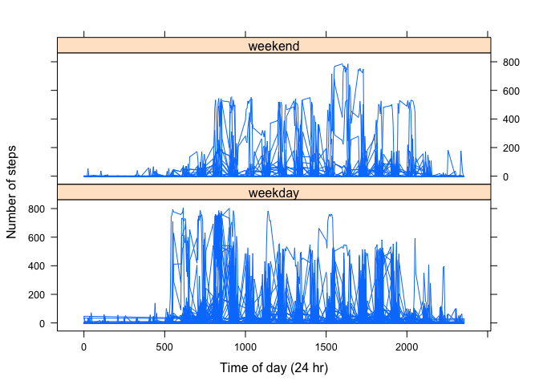
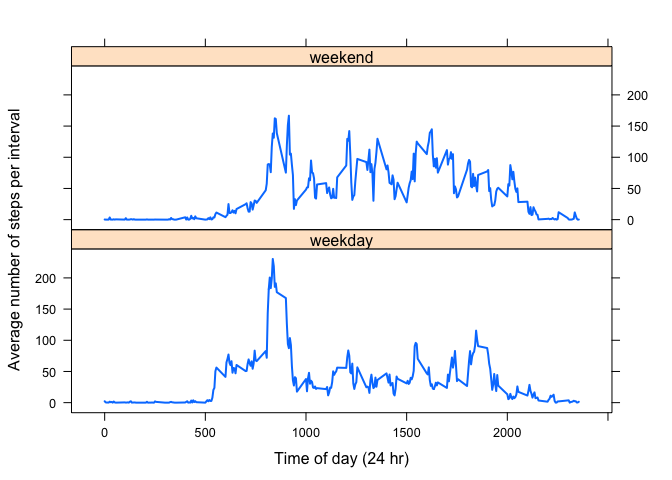

# Reproducible Research: Peer Assessment 1

This assignment makes use of data from a personal activity monitoring device. This device collects data at 5 minute intervals through out the day. The data consists of two months of data from an anonymous individual collected during the months of October and November, 2012 and include the number of steps taken in 5 minute intervals each day.

Data is given as three variables: _steps_, _date_ and _interval_.

* _steps_ gives the number of steps in the given interval
* _date_ gives the date on which the activity was measured
* _interval_ is an identifier for the time interval during which the activity was measured. This seems to be in accordance with the 24-hour clock.

There are 17,568 observations in the raw data file.

## Loading and preprocessing the data

Data is provided as a CSV file, which can be read simply with `read.csv()`. To speed up the processing of the data, the columns are specified to be of classes: numeric (_steps_ and _interval_) and Date (_date_).

```r
unzip(zipfile='activity.zip')
activity.raw <- read.csv("activity.csv",stringsAsFactors=FALSE,na.strings="NA",colClasses=c('numeric','Date','numeric'))
```
The raw data are processed to remove lines containing `NA`s. This reduces the number of observations to 15,264.

```r
activity <- na.omit(activity.raw)
```

## What is mean total number of steps taken per day?

The total number of steps per day can be discovered by summing over the _steps_ variable:

```r
stepsPerDay <- by(activity$steps,activity$date,sum)
```
Results are presented as a histogram, indicating that the subject most often took 10,000-11,000 steps on a given date:
 
We can obtain the actual mean and median number of steps per day as follows:

```r
mean(stepsPerDay); median(stepsPerDay)
```

```
## [1] 10766.19
```

```
## 2012-11-12 
##      10765
```

## What is the average daily activity pattern?

To investigate the subject's activity throughout the day, we can sum the number of steps in each 5-minute interval throughout the day and divide by the number of days over which the study was successfully performed.

```r
nDays <- length(unique(activity$date))
paste("Number of available days of the study =",nDays)
```

```
## [1] "Number of available days of the study = 53"
```

```r
stepsPerInterval <- by(activity$steps,activity$interval,sum)
plot(names(stepsPerInterval),stepsPerInterval/nDays,type='l',col='steelblue',xlab="Time of day (24 hr)",ylab="Average number of steps",main="Average daily activity pattern",lwd=2)
```

 
Peak activity, on average, occurs during the interval: '835':

```r
names(which.max(stepsPerInterval))
```

```
## [1] "835"
```
which, presumably, is the interval 8.35-8.40am.

## Imputing missing values

Since there are missing values (`NA`s) in the raw data, the lack of these values may introduce some bias into our results. We can calculate the number of incomplete records:

```r
nrow(activity.raw)-sum(complete.cases(activity.raw))
```

```
## [1] 2304
```
(which is some 13.1147541 percent of the entire study.)

We can replace these incomplete records with the mean value per day of the complete records for the relevant interval. The means, which are stored in `stepsPerInterval/nDays` are just inserted into `activity.fix$steps` where `is.na(activity.fix$steps)` is TRUE.

```r
activity.fix <- activity.raw
activity.fix$steps[is.na(activity.fix$steps)] <- stepsPerInterval[paste(activity.fix$interval[is.na(activity.fix$steps)])]/nDays
```
`activity.fix` is now the original dataset with the missing values filled in. We can repeat our 
original analysis, this time using `activity.fix`, to see if our results have changed significantly.


```r
fixedStepsPerDay <- by(activity.fix$steps,activity.fix$date,sum)
```

 
We can obtain the actual mean and median number of steps per day as follows:

```r
mean(fixedStepsPerDay); median(fixedStepsPerDay)
```

```
## [1] 10766.19
```

```
## 2012-11-04 
##   10766.19
```
Since there are many days with missing data, the median of the fixed data set has now become the value of an 'average' day: it has increased slightly since our initial estimate.

## Are there differences in activity patterns between weekdays and weekends?

We can separate the dates in the study into two groups, _weekdays_ and _weekends_, using the following code:

```r
activity.fix$dayType <- as.factor(sapply(weekdays(activity.fix$date), function(x) if (x == "Saturday"|x == "Sunday") {print("weekend")} else {print("weekday")}))
```

<!--

```r
library(lattice)
xyplot(activity.fix$steps~activity.fix$interval|activity.fix$dayType,type='l',layout=c(1,2),xlab="Time of day (24 hr)",ylab="Number of steps")
```

 
-->
We can then compare weekend to weekday activities, on average, throughout the day.

```r
partitionedData <- aggregate(steps~interval + dayType, mean, data=activity.fix)
names(partitionedData) <- c("interval","dayType","steps")
xyplot(partitionedData$steps~partitionedData$interval|partitionedData$dayType,type='l',layout=c(1,2),xlab="Time of day (24 hr)",ylab="Average number of steps per interval",lwd=2)
```

 
Thus we can see that slightly more steps are taken during the weekday mornings than at any other time -- presumably this is the morning commute. Weekend morning activities are shifted slightly later in the day, but also continue later into the evening. Whereas during the week activity dramatically peaks in the morning, before 9.30am, weekend activity is comparitively more uniform throughout the day.


